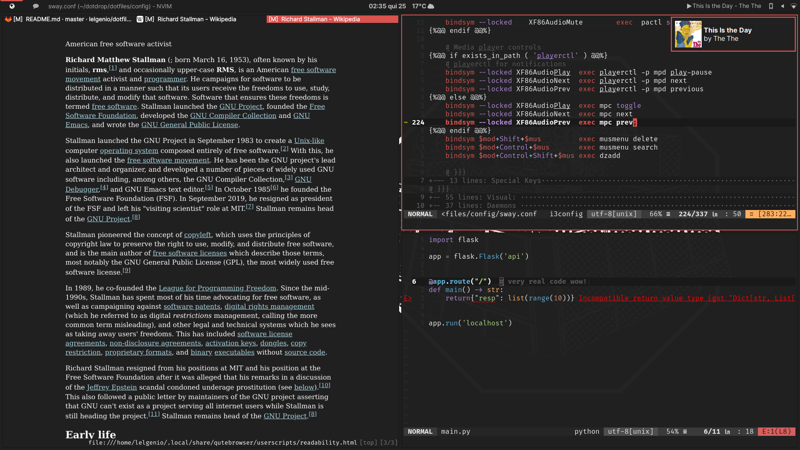

# My Dotfiles
## What I use:
* sway / Waybar
* Alacritty
* fish (fight me!)
* kakoune
* qutebrowser
* zathura
* mpd (optionally playerctl if installed)
* mpv (sponsorblock)
* btwOs

## Install:
Most files need to be pre-prossesed with dotdrop.
If you're on Arch this will install all packages automatically.
```bash
pip install --user dotdrop
dotdrop -c config.yaml install -p main
```

